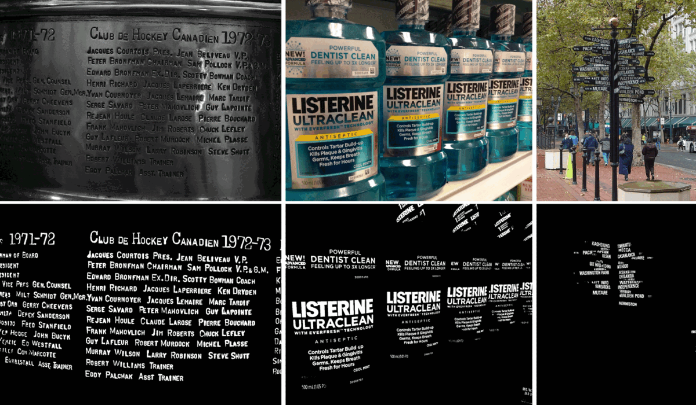

## Data Preparation

### Step1. Download

- **HierText**. Follow [the official repo of HierText](https://github.com/google-research-datasets/hiertext) to download  the dataset images. I label and provide the pixel-level text (stroke) segmentation ground-truths (png format, binary, 0 for background, 255 for text foreground), which can be downloaded with the following OneDrive links: [train_gt (131MB)](https://1drv.ms/u/s!AimBgYV7JjTlgcorK9fmoBp7QImvww?e=zRiNKL), [validation_gt (26MB)](https://1drv.ms/u/s!AimBgYV7JjTlgcooQOfgKDidqWvrAw?e=7NCHiC), [test_gt (25MB)](https://1drv.ms/u/s!AimBgYV7JjTlgcopZbsovlW6JVjomA?e=qw8Dht).



To training Hi-SAM for hierarchical text segmentation, download the [training gt json file](https://1drv.ms/u/s!AimBgYV7JjTlgctgYM0CKmQuMfwk8Q?e=Z8e4eb), which is derived from [the gt in HierText repo](https://github.com/google-research-datasets/hiertext/tree/main/gt) by using `HierText/process_gt.py`.

- **Total-Text**. Follow [the official repo of Total-Text](https://github.com/cs-chan/Total-Text-Dataset) to download the dataset. For text (stroke) segmentation, please download [the character level mask ground-truths](https://github.com/cs-chan/Total-Text-Dataset/tree/master/Groundtruth/Pixel/Character%20Level%20Mask).
- **TextSeg**. Follow [the official repo of TextSeg](https://github.com/SHI-Labs/Rethinking-Text-Segmentation) to apply for the dataset.

### Step2. Process & Organization

(1) For Total-Text, rename` groundtruth_pixel/Train/img61.JPG` to ` groundtruth_pixel/Train/img61.jpg` .

(2) For TextSeg, see `TextSeg/process_textseg.py` and use it to split the original data.

(3) Organize the datasets as the following structure:

```
|- HierText
|  |- train
|  |- train_gt
|  |- validation
|  |- validation_gt
|  |- test
|  |- test_gt
|  └  train_shrink_vert.json
|- TotalText
|  |- groundtruth_pixel
|     |- Test
|     └  Train
|  └  Images
|     |- Test
|     └  Train
|- TextSeg
|  |- train_images
|  |- train_gt
|  |- val_images
|  |- val_gt
|  |- test_images
|  └  test_gt
```